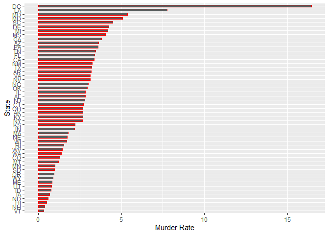
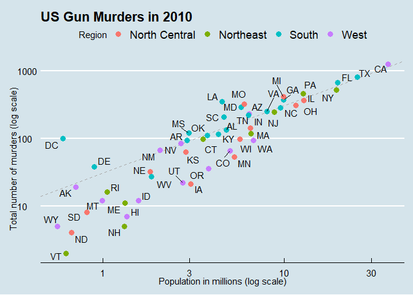

Report on Gun Murders
================
Sharmin Lalani
2021-05-05

## Introduction

This is a report on 2010 gun murder rates obtained from FBI reports.The
original data was obtained from Wikipedia.

We are going to use the following libraries:

``` r
library(tidyverse)
library(ggthemes)
library(ggrepel)
```

and load the wrangled data :

``` r
load("rda/murders.rda")
load("rda/avg_murders.rda")
```

## Murder rate by state

We notice a large state by state variability by generating a barplot
showing the murder rate by state.

<!-- -->

## Scatter Plot

<!-- -->
